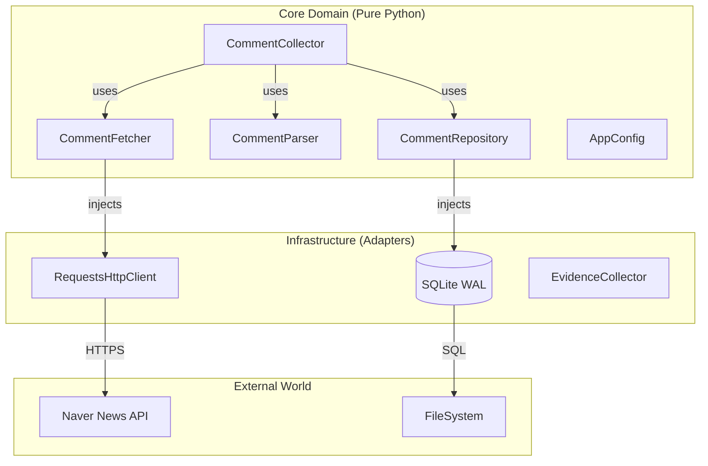

# 🦅 **NACT-MVP: High-Assurance Naver News Crawler**


> **"The Crawler That Sleeps at Night."**
>
> NACT (Naver Article Comment Tool) is an **enterprise-grade data pipeline** engineered for legal safety, structural resilience, and absolute operational determinism. Unlike fragile scripts, NACT is built with a **Zero-Trust TDD** philosophy.

---

## 🏛️ Architecture & Engineering Excellence

NACT adopts a **Hexagonal Architecture (Ports & Adapters)** to decouple business logic from external systems (Naver API, SQLite, Filesystem).

### 📐 High-Level Design (Mermaid)



### 🛡️ Why NACT is Superior?

| Feature         | ❌ Generic Crawler Scraper        | ✅ **NACT-MVP (Engineering)**                          |
| :-------------- | :-------------------------------- | :----------------------------------------------------- |
| **Stability**   | Spagetti code, breaks easily      | **SOLID / DIP applied**, easy to mock & test           |
| **Resilience**  | Crashes on 500 error              | **Circuit Breaker** & **Structural Failure Detection** |
| **Persistence** | CSV Append (Data Corruption risk) | **SQLite WAL Mode** (Transactional Integrity)          |
| **Testing**     | "Works on my machine"             | **100% Core Coverage** (Strict TDD)                    |
| **Privacy**     | Stores raw IDs (GDPR violation)   | **SHA-256 Hashing** by default (Privacy-First)         |
| **Debugging**   | `print()` based debug             | **Evidentiary Logging** (`failed_requests.jsonl`)      |

---

## 📂 Project Structure

A clean, modular structure ensuring **SRP (Single Responsibility Principle)**.

```text
src/
├── collectors/         # Business Logic for Data Acquisition
│   ├── article_parser.py   # HTML Parsing & Metadata Extraction
│   ├── comment_collector.py # Core Orchestration & Loop
│   ├── comment_fetcher.py   # HTTP Transport Layer (DIP)
│   ├── comment_parser.py    # JSONP Parsing & Schema Validation
│   └── search_collector.py  # OpenAPI & Fallback Search
├── ops/                # Operational Resiliency
│   ├── health_check.py     # Pre-flight Operational Probes
│   ├── probe.py            # Endpoint Auto-Discovery
│   ├── throttle.py         # Windowed Rate Limiting (429 Control)
│   └── evidence.py         # Forensic Logging
├── storage/            # Persistence Layer
│   ├── db.py               # SQLite Connection & WAL Manager
│   ├── repository.py       # Domain Object Persistence
│   └── exporters.py        # CSV/JSON Export Logic
├── common/             # Shared Types
│   └── errors.py           # Error Taxonomy (AppError)
└── main.py             # Composition Root
tests/                  # TDD Suite (Pytest)
```

---

## 🚀 Getting Started

### 1. Prerequisites

- Python 3.9+
- `pip` or `poetry`

### 2. Installation

Clone the repository and install dependencies.

```bash
git clone https://github.com/your-org/nact-mvp.git
cd nact-mvp
pip install -r requirements.txt
```

### 3. Configuration

NACT uses a strictly typed configuration system. Create your config from the default:

```bash
cp config/default.yaml config/production.yaml
```

**`config/production.yaml` snippet:**

```yaml
search:
  keywords: ["Artificial Intelligence", "Semiconductor"]
  sort: "date"

collection:
  max_comments: 10000
  rate_limit:
    requests_per_minute: 60
    burst: 5
```

### 4. Running the Collector

Execute the crawler. The **Pre-flight Health Check** will automatically verify network and selector integrity before starting the main loop.

```bash
# Run with default config
python -m src.main

# Run with custom config
python -m src.main --config config/production.yaml
```

---

## 🔬 Operational Hygiene (DevOps)

### Testing (TDD)

We follow a **Zero-Trust TDD Protocol**. No implementation exists without a failing test.

```bash
# Run full suite
pytest tests/

# Run with coverage
pytest --cov=src tests/
```

### Dealing with Failures

NACT distinguishes between **Transient** (Network) and **Structural** (Selector Change) failures.

- **Check Logs**: `./logs/nact.log` for app logs.
- **Forensics**: `./logs/failed_requests_*.jsonl` contains raw HTTP payloads of failed requests for debugging without re-running the crawler.

---

## ⚖️ License & Governance

Licensed under the **MIT License**.
This software is designed for **research and analytics**. Users are responsible for adhering to Naver's `robots.txt` and Terms of Service.

---

_Maintained by the NACT Engineering Team._
