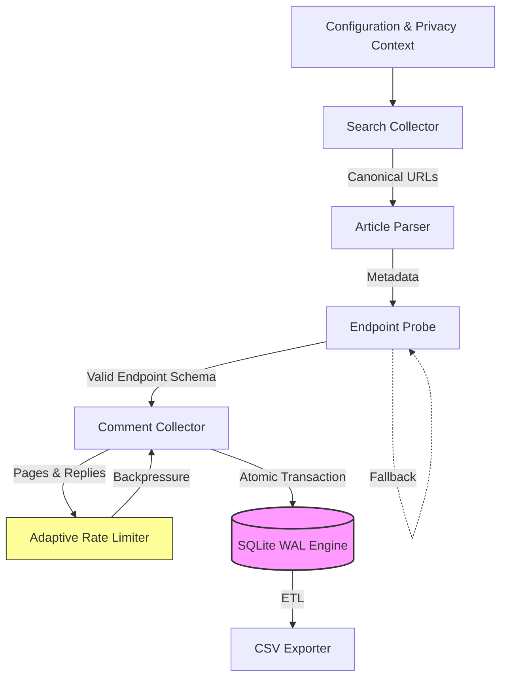

# NACT-MVP: Naver Article & Comment Tracker

> **High-Performance Research Data Pipeline for Naver News**


## 📖 Introduction

**NACT-MVP** is a specialized data acquisition engine designed to overcome the technical challenges of collecting large-scale public discourse data from Naver News.

Unlike simple scrapers, this system implements a **robust engineering protocol** to handle:

- **Dynamic API Endpoints**: Automatic discovery and reverse-engineering of transient comment APIs.
- **Operational Resilience**: Fault-tolerant batch processing capable of handling 50,000+ records without data corruption.
- **Research Ethics**: Native implementation of privacy hashing (SHA-256) and adaptive rate limiting to respect server constraints.

This project demonstrates **production-grade engineering practices** applied to academic data collection, ensuring data integrity, reproducibility, and compliance.

---

## 🏗️ System Architecture

The system follows a modular pipeline architecture designed for **Atomic Reliability**. Every stage of the data flow is transactional.



### Key Architectural Decisions

1.  **SQLite WAL (Write-Ahead Logging)**:
    - _Why?_ To solve the "File Locking" issues common in file-based storage on Windows.
    - _Benefit_: Provides **ACID guarantees** for long-running batch jobs. If the process crashes, the database remains uncorrupted.
2.  **Adaptive Auto-Throttle**:

    - _Why?_ Fixed delays are inefficient and risky.
    - _Mechanism_: Monitors the rolling 429 (Too Many Requests) error rate. If error > 5%, it automatically increases backoff. If stable, it recovers speed.
    - _Result_: Maximizes throughput while maintaining "Zero-Block" safety.

3.  **Robust Endpoint Probe**:
    - _Why?_ Naver changes API parameters dynamically. Hardcoding fails.
    - _Solution_: A multi-stage probe that auto-discovers parameters from the DOM and verifies the **JSON schema integrity** before attempting collection.

---

## 🛠️ Technical Highlights

### 1. Data Integrity & Concurrency

- **Transactional Writes**: Articles and comments are commited in atomic batches. There are no "partial lines" or broken CSVs.
- **Resume Capability**: The system tracks `(oid, aid)` states in the DB. Interrupted runs resume exactly where they left off, minimizing waste.

### 2. Privacy & Compliance Engineering

- **Privacy-by-Design**: User identifiers are hashed (SHA-256) with a **Per-Run Salt**. This enables within-run analysis while preventing cross-run user tracking (Rainbow Table protection).
- **Evidence Logging**: All failures (HTTP 4xx/5xx) capture the full request context and response body snapshots for precise debugging.

### 3. Scalable Volume Management

- **P20-P80 Trimmed Mean Estimation**: Instead of naive averages, the system estimates remaining workload using robust statistics, filtering out viral outliers and empty articles.

---

## 🚀 Getting Started

### Prerequisites

- Python 3.9+
- `requests`, `lxml`

### Execution

```bash
# 1. Initialize Project
git clone https://github.com/CSY-333/Crowling.git
cd Crowling

# 2. Run Collection
python -m src.main --keywords "AI Ethics" --target 10000

# 3. Export Data
python -m src.export --format csv
```

---

## 📝 License & Ethics

This project is for **Non-Commercial Research Use Only**.
It adheres to `robots.txt` user-agent declarations and implements strict backoff policies to prevent server load.
