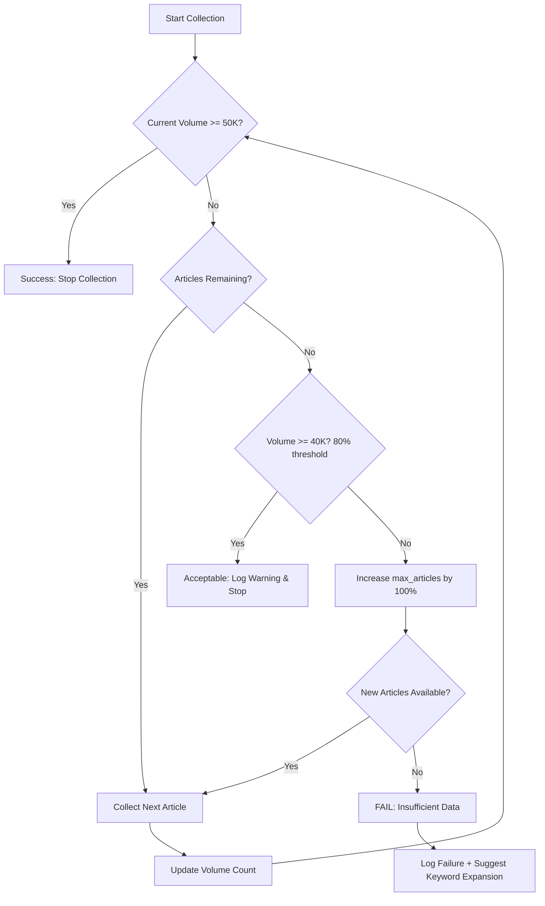
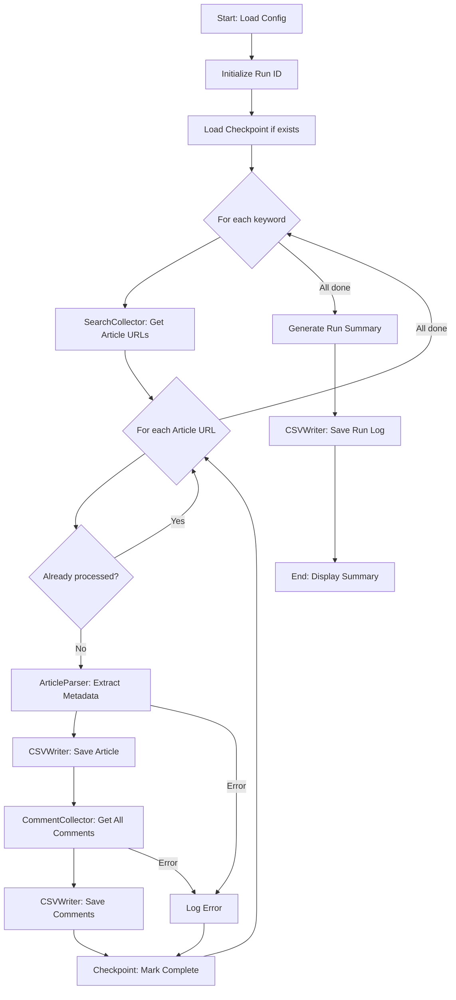

# Product Requirements Document (PRD)

## NACT-MVP: Naver Article & Comment Tracker

---

## Document Metadata

| Field             | Value                                           |
| ----------------- | ----------------------------------------------- |
| **Document Name** | NACT-MVP PRD (Naver Article & Comment Tracker)  |
| **Version**       | 1.0                                             |
| **Purpose**       | Research Dataset Generation (One-time Snapshot) |
| **Deliverables**  | CSV Datasets + Debug/Audit Logs (Mandatory)     |
| **Target Scale**  | 50,000+ comments across multiple articles       |
| **Author**        | Research Team                                   |
| **Last Updated**  | 2025-12-23                                      |

---

## Table of Contents

1. [Background & Problem Definition](#1-background--problem-definition)
2. [Goals & Non-Goals](#2-goals--non-goals)
3. [Users & Use Cases](#3-users--use-cases)
4. [Scope & Assumptions](#4-scope--assumptions)
5. [Functional Requirements](#5-functional-requirements)
6. [Non-Functional Requirements](#6-non-functional-requirements)
7. [Data Outputs (CSV Schema)](#7-data-outputs-csv-schema)
8. [System Design (MVP Architecture)](#8-system-design-mvp-architecture)
9. [Collection Policy (Anti-Blocking Strategy)](#9-collection-policy-anti-blocking-strategy)
10. [Success Criteria](#10-success-criteria)
11. [Risks & Mitigation](#11-risks--mitigation)
12. [MVP Development Milestones](#12-mvp-development-milestones)
13. [Open Issues](#13-open-issues)
14. [Additional Recommendations](#14-additional-recommendations)

---

## 1. Background & Problem Definition

### 1.1 Context

Naver News is one of the largest news aggregation platforms in South Korea, hosting articles from hundreds of media outlets with active user engagement through comments. For research purposes, there is a need to collect keyword-based article datasets along with their complete comment threads (including replies) to analyze public discourse, sentiment patterns, and information flow.

### 1.2 Problem Statement

The current challenge involves:

1. **No Pre-existing URL List**: Article URLs must be discovered through keyword-based search rather than from a predefined list
2. **Dynamic Comment Loading**: Comments are loaded dynamically through unofficial API endpoints, making HTML-only scraping unreliable for complete data collection
3. **Temporal Snapshot Requirements**: Need to capture a point-in-time snapshot with proper timestamp recording (both article publication time and crawl time)
4. **Scale Constraints**: Target collection of ~50,000 comments across multiple articles while managing rate limits and potential blocking

### 1.3 Current Limitations

- No official API for comment retrieval (unlike article search)
- Unpredictable anti-scraping measures from Naver
- Sorting/ranking is not controllable; we accept default ordering
- Comment threads can be deep (replies to replies) and paginated

---

## 2. Goals & Non-Goals

### 2.1 Goals (In Scope)

| Priority | Goal                                                          | Success Metric                                     |
| -------- | ------------------------------------------------------------- | -------------------------------------------------- |
| **P0**   | Collect Naver News articles based on keyword search           | ≥100 articles per keyword                          |
| **P0**   | Collect all comments and replies for each article             | ≥50,000 total comments                             |
| **P0**   | Export data to structured CSV format                          | Valid CSV files with all required fields           |
| **P0**   | Generate comprehensive debug/audit logs                       | Complete run_log.csv for every execution           |
| **P1**   | Record temporal metadata (crawl_at, published_at, updated_at) | All timestamps captured where available            |
| **P1**   | Implement checkpoint/resume capability                        | Can resume after interruption without full restart |
| **P2**   | Handle failures gracefully with retry logic                   | <10% failure rate on stable network                |

### 2.2 Non-Goals (Out of Scope)

| Non-Goal                                 | Rationale                                            |
| ---------------------------------------- | ---------------------------------------------------- |
| Continuous tracking/monitoring over time | This is a one-time snapshot, not a monitoring system |
| Login-based user identification          | Research focuses on public data only                 |
| Sentiment analysis or NLP processing     | Secondary processing is a separate phase             |
| Real-time data collection                | Batch processing is acceptable for research          |
| Comment ranking/sorting control          | Accept default ordering from Naver                   |
| Personalized/user-specific data          | Only public, non-authenticated data                  |

---

## 3. Users & Use Cases

### 3.1 Primary User

**Researcher** (Internal team member conducting social media/news discourse analysis)

### 3.2 User Persona

- **Technical Proficiency**: Intermediate (can run Python scripts, understand CSV data)
- **Research Focus**: Public opinion analysis, information diffusion, sentiment trends
- **Constraints**: Limited time for data collection; needs reliable, reproducible datasets
- **Success Definition**: Clean, complete dataset ready for analysis in R/Python

### 3.3 Primary Use Case (MVP Scenario)

```
GIVEN: Researcher has identified 1-N keywords of interest
WHEN: Researcher runs the NACT-MVP tool with keyword list and configuration
THEN: System performs the following:
  1. Searches Naver News for articles matching each keyword
  2. Collects article metadata (title, press, timestamps, URL)
  3. Collects all comments and replies for each article
  4. Saves data to CSV files (articles.csv, comments.csv)
  5. Generates execution log (run_log.csv) with summary statistics
  6. Provides summary report (total articles, comments, failure rate)
```

### 3.4 Secondary Use Cases

- **Resume after interruption**: If collection stops mid-run, can resume from checkpoint
- **Audit trail**: Review run_log.csv to understand what was collected and any failures
- **Error diagnosis**: Use detailed logs to troubleshoot collection issues

---

## 4. Scope & Assumptions

### 4.1 Collection Policy (Core Safety Principles)

> [!IMPORTANT]
> Naver's anti-scraping policies are unpredictable and subject to change. The MVP must be resilient to blocking, rate limiting, and structural changes.

The system will implement the following **mandatory** safety mechanisms:

| Mechanism               | Description                          | Implementation                                                    |
| ----------------------- | ------------------------------------ | ----------------------------------------------------------------- |
| **Rate Limiting**       | Prevent overwhelming Naver servers   | Random delay (1-3s) between requests; max 1-3 concurrent requests |
| **Exponential Backoff** | Handle temporary failures gracefully | Retry with increasing delays on 429/5xx/timeout errors            |
| **Failure Isolation**   | Prevent cascade failures             | Article/comment failures logged but don't stop entire run         |
| **Checkpoint/Resume**   | Enable recovery from interruptions   | Save progress at article-level granularity                        |

> [!CAUTION]
> Without these four mechanisms, the "50,000 comments" target is aspirational, not achievable.

### 4.2 Assumptions

1. **Network Stability**: Reasonable internet connection (occasional failures acceptable)
2. **Naver Structure Stability**: Comment endpoint structure remains relatively stable during collection period
3. **Public Data Only**: All collected data is publicly accessible without authentication
4. **Batch Processing Acceptable**: Long-running execution (hours) is acceptable for research purposes
5. **Keyword Quality**: User provides relevant keywords that yield sufficient articles

### 4.3 Constraints

- **No Authentication**: System operates without Naver login
- **No Real-time Requirements**: Snapshot collection, not live monitoring
- **Storage**: Local filesystem with sufficient space for CSV files (~100MB-1GB estimated)
- **Execution Environment**: Python 3.8+ environment with standard libraries

---

## 5. Functional Requirements

### 5.1 Keyword → Article List Collection

#### 5.1.1 Input Parameters

| Parameter      | Type      | Required | Default | Description                                     |
| -------------- | --------- | -------- | ------- | ----------------------------------------------- |
| `keywords`     | List[str] | Yes      | -       | List of search keywords                         |
| `start_date`   | Date      | No       | None    | Filter articles after this date (if supported)  |
| `end_date`     | Date      | No       | None    | Filter articles before this date (if supported) |
| `max_articles` | int       | No       | 300     | Maximum articles to collect per keyword         |
| `sort_order`   | str       | No       | "rel"   | Sort order (relevance/date) - use default       |

#### 5.1.2 Collection Approach (Priority Order)

**Option 1 (Recommended): Naver Search OpenAPI**

- **Pros**: Official API, stable, documented rate limits, reproducible
- **Cons**: Requires API key registration, daily quota limits (25,000 calls/day)
- **Documentation**: [Naver Developers - News Search API](https://developers.naver.com/docs/serviceapi/search/news/news.md)
- **Implementation Priority**: **PRIMARY**

> [!TIP] > **API Quota Estimation**
>
> The OpenAPI returns up to 100 articles per call. To estimate quota usage:
>
> **Formula**: `API_calls = ceil(max_articles / 100) × num_keywords`
>
> **Examples**:
>
> - 1 keyword, 300 articles: `ceil(300/100) × 1 = 3 calls`
> - 5 keywords, 500 articles each: `ceil(500/100) × 5 = 25 calls`
> - 10 keywords, 1000 articles each: `ceil(1000/100) × 10 = 100 calls`
>
> **Daily Limit**: 25,000 calls = ~2,500 keywords at 300 articles each
>
> **Recommendation**: For MVP with 2-5 keywords, quota is more than sufficient. Monitor usage via API response headers.

**Option 2 (Fallback): HTML Parsing**

- **Pros**: No API key required, no quota limits
- **Pros**: No API key required, no quota limits
- **Cons**: Fragile (structure changes), higher blocking risk, harder to maintain
- **Implementation Priority**: **SECONDARY** (only if OpenAPI unavailable)

#### 5.1.3 Output Fields

| Field              | Type     | Description                                          | Source                |
| ------------------ | -------- | ---------------------------------------------------- | --------------------- |
| `article_url`      | str      | Full URL to article (canonical)                      | Search result         |
| `oid`              | str      | Office ID (media outlet identifier)                  | Extracted from URL    |
| `aid`              | str      | Article ID                                           | Extracted from URL    |
| `title`            | str      | Article headline                                     | Search result         |
| `press`            | str      | Media outlet name                                    | Search result         |
| `published_at`     | datetime | Publication timestamp                                | Search result         |
| `source_keyword`   | str      | Keyword that found this article                      | Input parameter       |
| `matched_keywords` | str      | All keywords matching this article (comma-separated) | Deduplication process |
| `search_rank`      | int      | Position in search results                           | Search result index   |

> [!TIP]
> Extracting `oid` and `aid` from article URLs is critical for reliable comment collection. These identifiers are used in comment API endpoints.

#### 5.1.4 Article Deduplication Strategy

> [!IMPORTANT] > **Deduplication Policy**
>
> When multiple keywords find the same article, deduplicate using this priority:
>
> **Primary Key**: `(oid, aid)` tuple
>
> - Extract from URL pattern: `https://n.news.naver.com/article/{oid}/{aid}`
> - If extraction fails, fall back to URL normalization
>
> **URL Normalization** (fallback):
>
> 1. Remove query parameters (except essential ones)
> 2. Normalize domain: `m.news.naver.com` → `n.news.naver.com`
> 3. Remove trailing slashes
> 4. Lowercase scheme and domain
>
> **Handling Duplicates**:
>
> - Keep first occurrence in `articles.csv`
> - Update `matched_keywords` to include all keywords that found it
> - Example: `source_keyword="기후변화"`, `matched_keywords="기후변화,환경,탄소중립"`
>
> **Implementation**:
>
> ```python
> import re
> from urllib.parse import urlparse
> from typing import Tuple
>
> def extract_article_key(url: str) -> Tuple[str, str]:
>     """Extract (oid, aid) from Naver News URL"""
>     pattern = r'article/(\d+)/(\d+)'
>     match = re.search(pattern, url)
>     if match:
>         return (match.group(1), match.group(2))
>     return (None, None)
>
> def normalize_url(url: str) -> str:
>     """Normalize URL for deduplication"""
>     parsed = urlparse(url)
>     domain = parsed.netloc.replace('m.news.naver.com', 'n.news.naver.com')
>     path = parsed.path.rstrip('/')
>     return f"{parsed.scheme.lower()}://{domain}{path}"
> ```

---

### 5.2 Article Metadata Collection

For each article URL collected in 5.1, extract detailed metadata from the article page HTML.

#### 5.2.1 Required Fields

| Field          | Type     | Required | Extraction Method                                        |
| -------------- | -------- | -------- | -------------------------------------------------------- |
| `title`        | str      | Yes      | `<meta property="og:title">` or `<h2 id="title_area">`   |
| `press`        | str      | Yes      | `<meta property="og:article:author">` or press logo area |
| `published_at` | datetime | Yes      | `<span class="media_end_head_info_datestamp_time">`      |
| `updated_at`   | datetime | No       | Modified time element (if exists)                        |
| `section`      | str      | No       | Category/section metadata                                |
| `body_length`  | int      | No       | Character count of article body                          |

#### 5.2.2 Parsing Strategy

1.  **Primary**: Use structured metadata tags (`<meta>` tags, JSON-LD)
2.  **Fallback**: CSS selectors for known HTML structure
3.  **Error Handling**: If parsing fails, log error and continue with partial data

> [!NOTE]
> Even for "snapshot" collection, capturing `published_at` and `updated_at` is essential for temporal analysis.

---

### 5.3 Comment & Reply Collection

#### 5.3.1 Requirement

**"Collect ALL comments and replies"** - This is the core challenge of the MVP.

> [!IMPORTANT] > **Definition of "ALL Comments"**
>
> In practice, "ALL" means:
>
> 1.  **Complete API Response**: Collect all comments returned by the comment API endpoint through complete pagination
> 2.  **Deleted/Blind Comments**: Record these with special status flags (e.g., `is_deleted=true`, `is_blind=true`) rather than skipping
> 3.  **Depth Limitation**: Naver typically supports depth 0 (top-level) and depth 1 (replies). Deeper nesting is rare but should be handled if encountered
> 4.  **"Load More" Handling**: Continue pagination until API returns empty result or error
> 5.  **Partial Success**: If collection fails mid-way, save what was collected and log the failure point
>
> **Not Included**:
>
> - Comments hidden by user privacy settings (not accessible via public API)
> - Comments that require authentication to view
> - Future comments added after crawl_at timestamp

#### 5.3.2 Collection Approach

**Primary Strategy: JSON Endpoint Replication**

Naver loads comments via AJAX calls to unofficial JSON endpoints. The system will:

1.  **Identify Comment Endpoint**: Typically follows pattern like:

    ```
    https://apis.naver.com/commentBox/cbox/web_neo_list_jsonp.json?
    ticket=news&templateId=default_society&pool=cbox5&
    _cv={version}&_callback={callback}&lang=ko&country=KR&
    objectId=news{oid},{aid}&categoryId=&pageSize=20&indexSize=10&
    groupId=&listType=OBJECT&pageType=more&page={page}&
    refresh=false&sort=FAVORITE
    ```

2.  **Pagination Loop**: Iterate through all pages until no more comments returned

3.  **Reply Collection**: For each comment with `replyCount > 0`, fetch replies via similar endpoint

4.  **Rate Limiting**: Apply delays between requests (see Section 9)

**JSONP Response Handling**

> [!IMPORTANT]
> The comment endpoint returns **JSONP** (JSON with Padding), not pure JSON.
>
> **Parsing Rules**:
>
> 1.  **Strip Callback Wrapper**: Response format is `callbackName({...json...})`
>     - Extract JSON content between first `(` and last `)`
>     - Handle edge cases: nested parentheses in JSON strings
> 2.  **Callback Name**: May be dynamic (e.g., `jQuery123456_789`)
>     - Use regex: `^[^(]+\((.+)\);?$` to extract JSON
> 3.  **Encoding**: Response is typically UTF-8 with escaped Unicode
>     - Decode `\uXXXX` sequences properly
> 4.  **Error Responses**: May return HTML error page instead of JSONP
>     - Validate response starts with expected callback pattern
>     - If validation fails, save raw response to `logs/failed_responses/` for debugging
>
> **Example Implementation**:
>
> ```python
> import re
> import json
>
> def parse_jsonp(response_text: str) -> dict:
>     # Strip JSONP wrapper
>     match = re.match(r'^[^(]+\((.+)\);?$', response_text.strip())
>     if not match:
>         raise ValueError("Invalid JSONP format")
>     json_str = match.group(1)
>     return json.loads(json_str)
> ```

**Fallback Strategy: Partial Collection**

If JSON endpoint fails or changes:

- Collect visible comments from HTML
- Log failure reason and partial data count
- Continue with next article

> [!WARNING]
> Comment endpoints are **unofficial** and may change without notice. Robust error handling is mandatory.

#### 5.3.3 Collected Fields

| Column            | Type     | Required | Description                                         |
| ----------------- | -------- | -------- | --------------------------------------------------- |
| `comment_id`      | str      | Yes      | Unique comment identifier                           |
| `parent_id`       | str      | No       | Parent comment ID (for replies)                     |
| `depth`           | int      | Yes      | 0=top-level, 1=reply, 2+=nested (if exists)         |
| `content`         | str      | Yes      | Comment text (raw)                                  |
| `author_nickname` | str      | Yes\*    | User nickname (\*collected but may be masked later) |
| `created_at`      | datetime | Yes      | Comment creation timestamp                          |
| `likes`           | int      | No       | Like count                                          |
| `dislikes`        | int      | No       | Dislike count                                       |
| `replies_count`   | int      | No       | Number of replies                                   |
| `is_deleted`      | bool     | Yes      | True if comment is deleted/removed                  |
| `is_blind`        | bool     | Yes      | True if comment is blinded/hidden                   |
| `crawl_at`        | datetime | Yes      | Timestamp when comment was collected                |
| `article_url`     | str      | Yes      | Associated article URL                              |
| `oid`             | str      | Yes      | Office ID                                           |
| `aid`             | str      | Yes      | Article ID                                          |
| `keyword`         | str      | Yes      | Keyword that led to this article                    |

> [!NOTE] > **Deleted/Blind Comments**: These are still recorded with `is_deleted=true` or `is_blind=true`. The `content` field may be empty or contain placeholder text like "[삭제된 댓글입니다]".

#### 5.3.4 Sorting & Ordering

- **Accept default ordering** from Naver (typically "FAVORITE" or "NEWEST")
- **Goal**: Complete collection, not specific ordering
- **Implementation**: Iterate through all pages regardless of sort order

#### 5.3.5 Comment Collection Validation

After collecting comments for an article, validate completeness:

```python
# Pseudo-code for validation
for comment in top_level_comments:
    if comment.replies_count > 0:
        actual_replies = count_replies(comment.comment_id)
        if actual_replies != comment.replies_count:
            log_warning(f"Reply count mismatch: expected {comment.replies_count}, got {actual_replies}")
```

This helps detect incomplete collection early.

---

### 5.4 Volume Achievement Strategy

> [!CAUTION] > **Critical Gap: Article Count ≠ Comment Volume**
>
> The 50,000 comment target cannot be guaranteed by simply collecting N articles. Naver News comment distribution follows a heavy-tail distribution. **Average-based estimation is dangerous and optimistic.**
>
> **The MVP MUST include adaptive volume achievement logic based on conservative quantiles.**

#### 5.4.1 Volume Tracking & Adaptive Expansion (Quantile-Based)

**Logic**:
Instead of `avg_comments`, use **P70 or P80** (70th/80th percentile) of recent articles to estimate remaining yield. This accounts for the fact that most articles have few comments.

```python
import numpy as np

class VolumeTracker:
    def __init__(self, target_comments: int = 50000):
        self.target = target_comments
        self.current_total = 0
        self.article_counts = []  # History of comment counts

    def estimate_remaining_articles(self) -> int:
        """
        Estimate articles needed using P70 (conservative) to P80.
        """
        if not self.article_counts:
            return 1000 # Initial pessimistic guess

        remaining_comments = self.target - self.current_total
        if remaining_comments <= 0:
            return 0

        # Use P70 (30% of articles perform better than this)
        # We assume new articles will perform similarly to the bottom 70% 'average'
        # actually, for 'safety' we want to know how many articles we need if they perform 'poorly'?
        # No, we want a realistic estimate.
        # Heavy tail means mean > median.
        # Using Median (P50) is safer than Mean. P70 is even safer (assuming lower yield).
        # Let's uses Median (P50) as a baseline conservative yield.

        yield_per_article = np.percentile(self.article_counts, 50) # Median
        yield_per_article = max(yield_per_article, 1) # Avoid div by zero

        return int(remaining_comments / yield_per_article)
```

**Adaptive Strategies** (in priority order):

| Strategy                           | When to Apply                                   | Implementation                                                       |
| ---------------------------------- | ----------------------------------------------- | -------------------------------------------------------------------- |
| **1. Increase max_articles**       | `current_total < target`                        | Increase `max_articles` based on P50 yield estimate                  |
| **2. Pre-filter by comment count** | Available if search API provides comment counts | Sort by comment count descending; collect high-volume articles first |
| **3. Keyword expansion**           | Single keyword exhausted                        | Add related keywords (synonyms) from config                          |
| **4. Date range expansion**        | Temporal filter too restrictive                 | Expand date range backward                                           |

> [!WARNING] > **Bias Risk**: Stopping exactly at 40k/50k by prioritizing high-volume articles creates a **selection bias** towards controversial/viral topics. This limitation must be documented in the dataset metadata.

#### 5.4.2 Comment Count Pre-Check (Optional Optimization)

If the search API or article page provides comment count metadata:

```python
def prioritize_by_comment_volume(articles: List[Article]) -> List[Article]:
    """
    Sort articles by estimated comment count (if available).
    Collect high-volume articles first to reach target faster.
    """
    # Extract comment count from article metadata
    for article in articles:
        article.estimated_comments = extract_comment_count_hint(article)

    # Sort descending by comment count
    return sorted(articles, key=lambda a: a.estimated_comments or 0, reverse=True)
```

**Benefits**:

- Reach 50K target with fewer articles
- Reduce total execution time
- Lower risk of hitting rate limits

#### 5.4.3 Volume Achievement Decision Tree



#### 5.4.4 Configuration Parameters

Add to `config.yaml`:

```yaml
volume_strategy:
  target_comments: 50000
  min_acceptable_comments: 40000 # 80% threshold
  auto_expand_articles: true # Automatically increase max_articles if needed
  expansion_factor: 1.5 # Multiply max_articles by this when expanding
  max_total_articles: 2000 # Hard limit to prevent runaway collection
  prioritize_by_comment_count: true # If metadata available
```

#### 5.4.5 Success Criteria

| Metric                 | Target                        | Fallback                            |
| ---------------------- | ----------------------------- | ----------------------------------- |
| **Primary**            | ≥50,000 comments              | ≥40,000 comments (80% threshold)    |
| **Article Efficiency** | ≥100 comments/article average | Log warning if <50 comments/article |
| **Execution Time**     | <8 hours for 50K comments     | Acceptable up to 12 hours           |

> [!IMPORTANT] > **Logging Requirements**
>
> The system MUST log:
>
> - Volume progress every 10 articles: `"Progress: 12,450 / 50,000 comments (24.9%) from 68 articles"`
> - Adaptive decisions: `"Volume insufficient (18,234 / 50,000). Increasing max_articles from 300 to 450."`
> - Final outcome: `"Target achieved: 52,341 comments from 285 articles (avg 183.6 per article)"`

---

### 5.5 Endpoint Probe & Validation

> [!CAUTION] > **Implementation Reality Check**
>
> Finding parameters via Regex from HTML is fragile (A/B testing, obfuscation).
> **The Probe MUST be robust and self-correcting.**

#### 5.5.1 Robust Endpoint Discovery

**Priority Sequence**:

1.  **Auto-Discovery (Regex/DOM)**: Attempt to parse `ticket`, `templateId`, `pool` from article HTML.
2.  **Known Fallbacks**: Iterate through a list of known valid configurations (hardcoded in `config.yaml`).
3.  **Cross-Article Probe**: If fails on Article A, try Article B and C (maybe A is special).
4.  **Manual Override**: Allow user to inject parameters via config if all else fails.

```python
class RobustEndpointProbe:
    def resolve_endpoint(self, sample_articles: List[str]) -> Optional[Dict]:
        # 1. Try Auto-Discovery on multiple articles
        for url in sample_articles:
            params = self._try_extract_from_html(url)
            if params and self._validate(params):
                logger.info(f"Endpoint auto-discovered from {url}")
                return params

        # 2. Try Known Fallbacks (Historical configs)
        for config in self.known_configs:
            if self._validate(config):
                logger.info("Endpoint resolved using fallback config")
                return config

        # 3. Fail
        return None
```

#### 5.5.2 Health Check Before Collection

**Pre-flight Test** (run once per execution):

```python
def run_health_check(keywords: List[str]) -> bool:
    """
    Before starting full collection, verify comment endpoint works.

    Process:
    1. Get 3 sample articles from first keyword
    2. Attempt to fetch first page of comments for each
    3. If 2/3 succeed, proceed
    4. If 0/3 succeed, FAIL FAST with clear error
    """
    sample_articles = search_collector.search_by_keyword(keywords[0], max_articles=3)

    successes = 0
    for article in sample_articles:
        try:
            endpoint_params = probe.discover_comment_endpoint(article.url, article.oid, article.aid)
            if validate_endpoint(endpoint_params, article.oid, article.aid):
                successes += 1
        except Exception as e:
            logger.warning(f"Health check failed for {article.url}: {e}")

    if successes >= 2:
        logger.info(f"✓ Health check passed: {successes}/3 articles returned comments")
        return True
    else:
        logger.error(f"✗ Health check FAILED: {successes}/3 articles returned comments")
        logger.error("Comment endpoint may have changed. Manual investigation required.")
        return False
```

#### 5.5.2 Fail-Fast & Recovery

- **Validation**: Must pass a live request test (GET 1 page) before starting run.
- **Runtime Failure**: If `JSONP_PARSE_ERROR` spikes, trigger re-probe (Auto-Recovery) before stopping.

#### 5.5.3 Fail-Fast Error Patterns

Certain error patterns indicate structural changes (not transient failures):

| Error Pattern                             | Interpretation                   | Action            |
| ----------------------------------------- | -------------------------------- | ----------------- |
| **100% JSONP parse failures**             | Endpoint response format changed | STOP + alert user |
| **All requests return HTML error page**   | Endpoint URL structure changed   | STOP + alert user |
| **Consistent 404 on comment endpoint**    | Endpoint path changed            | STOP + alert user |
| **Valid JSONP but missing expected keys** | API response schema changed      | STOP + alert user |

```python
class StructuralFailureDetector:
    def __init__(self, threshold: int = 10):
        self.consecutive_structural_failures = 0
        self.threshold = threshold

    def check_failure(self, error_type: str) -> bool:
        """
        Returns True if should STOP collection (structural failure detected)
        """
        if error_type in ['JSONP_PARSE_ERROR', 'SCHEMA_MISMATCH', 'ENDPOINT_404']:
            self.consecutive_structural_failures += 1
        else:
            self.consecutive_structural_failures = 0  # Reset on transient errors

        if self.consecutive_structural_failures >= self.threshold:
            logger.critical(f"STRUCTURAL FAILURE DETECTED: {self.consecutive_structural_failures} consecutive failures")
            logger.critical("Comment endpoint has likely changed. Stopping collection.")
            return True

        return False
```

#### 5.5.4 Endpoint Version Tracking

Log discovered endpoint parameters for reproducibility:

```python
# In run_log.csv, add field:
endpoint_config_json: str  # JSON dump of discovered endpoint parameters

# Example value:
{
  "base_url": "https://apis.naver.com/commentBox/cbox/web_neo_list_jsonp.json",
  "ticket": "news",
  "templateId": "default_society",
  "pool": "cbox5",
  "_cv": "20231215",
  "discovered_at": "2025-12-23T20:00:00+09:00"
}
```

This allows:

- Reproducing collection with same endpoint version
- Detecting when endpoint parameters changed between runs
- Debugging endpoint-related failures

> [!IMPORTANT] > **MVP Decision: Endpoint Discovery**
>
> - **Primary**: Attempt automatic discovery from article page
> - **Fallback**: Use hardcoded default parameters (documented in config)
> - **Validation**: ALWAYS run health check before full collection
> - **Fail-Fast**: Stop after 10 consecutive structural failures

---

### 7. Data Outputs (CSV Schema)

> [!WARNING] > **DEPRECATED SECTION** > **The Data Schema and Storage Architecture have been updated to SQLite-first.**
> Please refer to **PRD_ADDENDUM.md Section 3** for the authoritative schema definitions for `articles` and `comments` tables.
> The CSVs below are only valid as _export artifacts_, not runtime storage.

#### 7.1 articles.csv (Export Only)

| Column        | Type     | Nullable | Description                             |
| ------------- | -------- | -------- | --------------------------------------- |
| `run_id`      | str      | No       | Unique identifier for this execution    |
| `snapshot_at` | datetime | No       | **Run-level reference time** (ISO 8601) |
| `oid`         | str      | **No**   | Office ID (Required)                    |
| `aid`         | str      | **No**   | Article ID (Required)                   |
| `article_url` | str      | No       | Full article URL                        |
| ...           | ...      | ...      | ...                                     |
| `crawl_at`    | datetime | No       | When metdata was collected              |

#### 7.2 comments.csv

| Column        | Type     | Nullable | Description                  |
| ------------- | -------- | -------- | ---------------------------- |
| `run_id`      | str      | No       | Execution identifier         |
| `snapshot_at` | datetime | No       | **Run-level reference time** |
| `oid`         | str      | **No**   | Office ID                    |
| `aid`         | str      | **No**   | Article ID                   |
| `comment_id`  | str      | No       | Unique comment identifier    |
| ...           | ...      | ...      | ...                          |
| `crawl_at`    | datetime | No       | Collection timestamp         |

---

### 5.6 Enhanced Completeness Verification

> [!CAUTION] > **Critical Gap: "Collected" ≠ "Complete"**
>
> Section 5.3.5 only validates `replies_count` vs actual replies. Real completeness issues are more subtle:
>
> - Pagination cursors that loop or skip
> - Duplicate comments from pagination bugs
> - Temporal anomalies (timestamps out of order)
> - Abnormal blind/deleted ratios

#### 5.6.1 Multi-Dimensional Completeness Checks

**1. Duplicate Detection**

```python
def check_duplicate_rate(comments: List[Comment]) -> float:
    """
    Calculate percentage of duplicate comment_ids.
    High duplicate rate indicates pagination bug.
    """
    total = len(comments)
    unique = len(set(c.comment_id for c in comments))
    duplicate_rate = (total - unique) / total if total > 0 else 0

    if duplicate_rate > 0.05:  # >5% duplicates
        logger.warning(f"High duplicate rate: {duplicate_rate:.1%} ({total - unique} duplicates)")

    return duplicate_rate
```

**2. Temporal Continuity Check**

```python
def check_temporal_continuity(comments: List[Comment]) -> Dict[str, Any]:
    """
    Validate comment timestamps are reasonable.

    Red flags:
    - Timestamps in the future
    - Large gaps suggesting missing pages
    - Identical timestamps for many comments (pagination stuck)
    """
    issues = {
        'future_timestamps': 0,
        'suspicious_gaps': 0,
        'timestamp_clusters': 0
    }

    now = datetime.now(timezone.utc)
    sorted_comments = sorted(comments, key=lambda c: c.created_at or datetime.min)

    for comment in sorted_comments:
        if comment.created_at and comment.created_at > now:
            issues['future_timestamps'] += 1

    # Check for timestamp clusters (>20 comments with exact same timestamp)
    from collections import Counter
    timestamp_counts = Counter(c.created_at for c in comments if c.created_at)
    for timestamp, count in timestamp_counts.items():
        if count > 20:
            issues['timestamp_clusters'] += 1
            logger.warning(f"Suspicious: {count} comments with identical timestamp {timestamp}")

    return issues
```

**3. Total Count Validation**

```python
def validate_total_count(api_total: Optional[int], collected: int) -> bool:
    """
    If API provides totalCount, verify we collected that many.

    Args:
        api_total: Total count from API response (if available)
        collected: Number of comments actually collected

    Returns:
        True if counts match (within tolerance), False if mismatch
    """
    if api_total is None:
        return True  # Can't validate if API doesn't provide count

    tolerance = 0.05  # Allow 5% discrepancy
    if abs(collected - api_total) / api_total > tolerance:
        logger.warning(f"Count mismatch: API reported {api_total}, collected {collected}")
        return False

    return True
```

**4. Status Distribution Monitoring**

```python
def check_status_distribution(comments: List[Comment]) -> Dict[str, float]:
    """
    Monitor ratio of normal/deleted/blind comments.
    Sudden changes may indicate collection issues.
    """
    total = len(comments)
    if total == 0:
        return {}

    normal = sum(1 for c in comments if not c.is_deleted and not c.is_blind)
    deleted = sum(1 for c in comments if c.is_deleted)
    blind = sum(1 for c in comments if c.is_blind)

    distribution = {
        'normal_rate': normal / total,
        'deleted_rate': deleted / total,
        'blind_rate': blind / total
    }

    # Alert if >50% are deleted/blind (unusual)
    if distribution['deleted_rate'] + distribution['blind_rate'] > 0.5:
        logger.warning(f"High deletion rate: {distribution['deleted_rate']:.1%} deleted, {distribution['blind_rate']:.1%} blind")

    return distribution
```

#### 5.6.2 Completeness Score

Aggregate all checks into a single completeness score:

```python
class CompletenessValidator:
    def calculate_completeness_score(
        self,
        comments: List[Comment],
        api_total: Optional[int] = None
    ) -> Dict[str, Any]:
        """
        Calculate overall completeness score (0-100).

        Scoring:
        - Duplicate rate: -20 points if >5%
        - Temporal issues: -10 points per issue type
        - Count mismatch: -30 points if >10% off
        - Status anomalies: -15 points if >50% deleted/blind
        """
        score = 100
        issues = []

        # Check duplicates
        dup_rate = check_duplicate_rate(comments)
        if dup_rate > 0.05:
            score -= 20
            issues.append(f"High duplicate rate: {dup_rate:.1%}")

        # Check temporal continuity
        temporal = check_temporal_continuity(comments)
        if temporal['future_timestamps'] > 0:
            score -= 10
            issues.append(f"{temporal['future_timestamps']} future timestamps")
        if temporal['timestamp_clusters'] > 0:
            score -= 10
            issues.append(f"{temporal['timestamp_clusters']} timestamp clusters")

        # Check total count
        if api_total and not validate_total_count(api_total, len(comments)):
            score -= 30
            issues.append(f"Count mismatch: expected {api_total}, got {len(comments)}")

        # Check status distribution
        dist = check_status_distribution(comments)
        if dist.get('deleted_rate', 0) + dist.get('blind_rate', 0) > 0.5:
            score -= 15
            issues.append(f"High deletion rate: {dist.get('deleted_rate', 0):.1%}")

        return {
            'score': max(score, 0),
            'issues': issues,
            'metrics': {
                'duplicate_rate': dup_rate,
                'temporal_issues': temporal,
                'status_distribution': dist
            }
        }
```

#### 5.6.3 Logging Completeness Metrics

Add to `run_log.csv`:

| Column                     | Type  | Description                                            |
| -------------------------- | ----- | ------------------------------------------------------ |
| `avg_completeness_score`   | float | Average completeness score across all articles (0-100) |
| `articles_with_issues`     | int   | Number of articles with completeness score <80         |
| `total_duplicate_comments` | int   | Total duplicate comments detected and removed          |

> [!IMPORTANT] > **Completeness Thresholds**
>
> - **Score ≥90**: Excellent - high confidence in completeness
> - **Score 70-89**: Good - minor issues, acceptable for research
> - **Score 50-69**: Fair - significant issues, review recommended
> - **Score <50**: Poor - data quality questionable, investigate

---

### 5.7 Snapshot Time Semantics

> [!CAUTION] > **Critical Gap: "Snapshot" is Ambiguous**
>
> The PRD claims this is a "snapshot" but doesn't define what timestamp represents the snapshot. If collection takes 6 hours, what is the "snapshot time"?

#### 5.7.1 Snapshot Time Definition

**Clarified Semantics**:

| Timestamp Field | Meaning                              | Scope                                    | Example                     |
| --------------- | ------------------------------------ | ---------------------------------------- | --------------------------- |
| `snapshot_at`   | **Official snapshot reference time** | Run-level (same for entire execution)    | `2025-12-23T20:00:00+09:00` |
| `crawl_at`      | **Actual collection time**           | Record-level (varies by article/comment) | `2025-12-23T22:15:30+09:00` |
| `published_at`  | **Content creation time**            | Article-level                            | `2025-12-20T14:30:00+09:00` |
| `created_at`    | **Comment creation time**            | Comment-level                            | `2025-12-20T15:30:00+09:00` |

**Snapshot Interpretation**:

> "This dataset represents a snapshot of Naver News as of `snapshot_at`. Individual records were collected between `snapshot_at` and `snapshot_at + execution_duration`, with actual collection times recorded in `crawl_at`."

#### 5.7.2 Implementation

**Add to `run_log.csv`**:

```python
run_log = {
    'run_id': 'run_20251223_200000',
    'snapshot_at': '2025-12-23T20:00:00+09:00',  # NEW: Official snapshot time
    'start_at': '2025-12-23T20:00:05+09:00',     # Actual execution start
    'end_at': '2025-12-23T22:15:30+09:00',       # Actual execution end
    'timezone': 'Asia/Seoul',                     # NEW: Explicit timezone
    ...
}
```

**Add to all CSV files**:

```python
# articles.csv and comments.csv
{
    'snapshot_at': '2025-12-23T20:00:00+09:00',  # Same for all records in this run
    'crawl_at': '2025-12-23T21:30:15+09:00',     # Varies by record
    ...
}
```

#### 5.7.3 Timezone Handling

> [!IMPORTANT] > **Timezone Policy**
>
> - **All timestamps stored in ISO 8601 format with timezone**: `2025-12-23T20:00:00+09:00`
> - **Default timezone**: `Asia/Seoul` (KST/UTC+9) for Naver News
> - **Internal processing**: Convert to UTC for calculations, store in original timezone
> - **Configuration**: Allow timezone override in config.yaml

```yaml
# config.yaml
snapshot:
  timezone: "Asia/Seoul" # or "UTC"
  reference_time: "start" # "start" = use execution start time, "manual" = user-specified
  manual_snapshot_time: null # If reference_time="manual", specify here
```

#### 5.7.4 Analysis Guidance

Include in documentation:

````markdown
## Using Snapshot Data for Analysis

### Temporal Filtering

When analyzing this dataset, use `snapshot_at` as the reference point:

```python
# Filter comments created before snapshot
df_comments['created_at'] = pd.to_datetime(df_comments['created_at'])
df_comments['snapshot_at'] = pd.to_datetime(df_comments['snapshot_at'])

# Comments that existed at snapshot time
valid_comments = df_comments[df_comments['created_at'] <= df_comments['snapshot_at']]
```
````

### Collection Delay

Account for collection delay when interpreting results:

```python
# Calculate how long after snapshot each comment was collected
df_comments['collection_delay'] = (
    df_comments['crawl_at'] - df_comments['snapshot_at']
).dt.total_seconds() / 3600  # hours

# Comments collected >2 hours after snapshot may have newer replies
late_collected = df_comments[df_comments['collection_delay'] > 2]
```

```

---


## 6. Non-Functional Requirements

### 6.1 Performance & Scale

| Metric                   | Target             | Notes                           |
| ------------------------ | ------------------ | ------------------------------- |
| **Total Comments**       | 50,000+            | Primary success metric          |
| **Articles per Keyword** | 100-1,000          | Configurable via `max_articles` |
| **Execution Time**       | Hours (acceptable) | Batch processing for research   |
| **Concurrency**          | 1-3 requests       | Minimize blocking risk          |
| **Memory Usage**         | <2GB RAM           | Streaming CSV writes            |
| **Disk Space**           | ~1GB               | Estimated for 50K comments      |

### 6.2 Reliability

| Requirement           | Implementation                                                        |
| --------------------- | --------------------------------------------------------------------- |
| **Failure Isolation** | Article-level error handling; one failure doesn't stop entire run     |
| **Retry Logic**       | Exponential backoff for 429/5xx/timeout (max 3 retries)               |
| **Checkpoint/Resume** | Save progress after each article; resume from last successful article |
| **Data Integrity**    | Validate CSV writes; atomic file operations                           |
| **Error Logging**     | All failures logged with context (article URL, error type, timestamp) |

### 6.3 Reproducibility

| Requirement                | Implementation                                    |
| -------------------------- | ------------------------------------------------- |
| **Parameter Logging**      | All input parameters saved to `run_log.csv`       |
| **Timestamp Recording**    | `crawl_at` field in all records                   |
| **Version Tracking**       | Log tool version and dependencies                 |
| **Deterministic Behavior** | Same inputs → same outputs (modulo Naver changes) |

### 6.4 Maintainability

| Requirement            | Implementation                                           |
| ---------------------- | -------------------------------------------------------- |
| **Modular Design**     | Separate modules for search, parsing, comment collection |
| **Configuration**      | Externalized config file (YAML/JSON)                     |
| **Logging Levels**     | DEBUG/INFO/WARNING/ERROR levels                          |
| **Code Documentation** | Docstrings for all public functions                      |

---

## 7. Data Outputs (CSV Schema)

### 7.1 articles.csv

Complete schema for article metadata:

| Column          | Type     | Nullable | Description                            | Example                                           |
| --------------- | -------- | -------- | -------------------------------------- | ------------------------------------------------- |
| `run_id`        | str      | No       | Unique identifier for this execution   | `run_20251223_195904`                             |
| `keyword`       | str      | No       | Search keyword                         | `"기후변화"`                                      |
| `search_rank`   | int      | No       | Position in search results (1-indexed) | `1`                                               |
| `article_url`   | str      | No       | Full article URL                       | `https://n.news.naver.com/article/001/0012345678` |
| `oid`           | str      | Yes      | Office ID (media outlet)               | `001`                                             |
| `aid`           | str      | Yes      | Article ID                             | `0012345678`                                      |
| `title`         | str      | No       | Article headline                       | `"Climate Change Impact on..."`                   |
| `press`         | str      | No       | Media outlet name                      | `"Yonhap News"`                                   |
| `published_at`  | datetime | Yes      | Publication timestamp (ISO 8601)       | `2025-12-20T14:30:00+09:00`                       |
| `updated_at`    | datetime | Yes      | Last update timestamp                  | `2025-12-20T15:45:00+09:00`                       |
| `crawled_at`    | datetime | No       | When metadata was collected            | `2025-12-23T19:59:04+09:00`                       |
| `status`        | str      | No       | Collection status                      | `OK` / `FAIL`                                     |
| `error_code`    | str      | Yes      | Error code if failed                   | `TIMEOUT` / `PARSE_ERROR`                         |
| `error_message` | str      | Yes      | Detailed error message                 | `"Connection timeout after 30s"`                  |

**Estimated Size**: ~1KB per row → 100 articles = ~100KB

---

### 7.2 comments.csv

Complete schema for comment data:

| Column            | Type     | Nullable | Description                            | Example                                           |
| ----------------- | -------- | -------- | -------------------------------------- | ------------------------------------------------- |
| `run_id`          | str      | No       | Execution identifier                   | `run_20251223_195904`                             |
| `keyword`         | str      | No       | Search keyword that found article      | `"기후변화"`                                      |
| `article_url`     | str      | No       | Associated article URL                 | `https://n.news.naver.com/article/001/0012345678` |
| `oid`             | str      | Yes      | Office ID                              | `001`                                             |
| `aid`             | str      | Yes      | Article ID                             | `0012345678`                                      |
| `comment_id`      | str      | No       | Unique comment identifier              | `cmt_123456789`                                   |
| `parent_id`       | str      | Yes      | Parent comment ID (null for top-level) | `cmt_123456780`                                   |
| `depth`           | int      | No       | Comment depth (0=comment, 1=reply)     | `0`                                               |
| `content`         | str      | No       | Comment text                           | `"This is very concerning..."`                    |
| `author_nickname` | str      | Yes      | User nickname                          | `"user***"`                                       |
| `created_at`      | datetime | Yes      | Comment creation time                  | `2025-12-20T15:30:00+09:00`                       |
| `likes`           | int      | Yes      | Like count                             | `42`                                              |
| `dislikes`        | int      | Yes      | Dislike count                          | `3`                                               |
| `replies_count`   | int      | Yes      | Number of replies                      | `5`                                               |
| `crawl_at`        | datetime | No       | Collection timestamp                   | `2025-12-23T19:59:04+09:00`                       |
| `status`          | str      | No       | Collection status                      | `OK` / `FAIL`                                     |
| `error_code`      | str      | Yes      | Error code if failed                   | `API_ERROR`                                       |
| `error_message`   | str      | Yes      | Error details                          | `"Comment endpoint returned 404"`                 |

**Estimated Size**: ~500 bytes per row → 50,000 comments = ~25MB

> [!NOTE] > **Privacy Note**: `author_nickname` is collected for completeness but can be masked/removed in post-processing for anonymization.

---

### 7.3 run_log.csv

Execution audit trail:

| Column                     | Type     | Nullable | Description                                | Example                                                |
| -------------------------- | -------- | -------- | ------------------------------------------ | ------------------------------------------------------ |
| `run_id`                   | str      | No       | Unique run identifier                      | `run_20251223_195904`                                  |
| `start_at`                 | datetime | No       | Execution start time                       | `2025-12-23T19:59:04+09:00`                            |
| `end_at`                   | datetime | Yes      | Execution end time (null if running)       | `2025-12-23T22:15:30+09:00`                            |
| `config_json`              | str      | No       | JSON string of all input parameters        | `{"keywords": ["기후변화"], "max_articles": 300, ...}` |
| `total_articles_found`     | int      | No       | Articles discovered in search              | `287`                                                  |
| `total_articles_crawled`   | int      | No       | Articles successfully processed            | `285`                                                  |
| `total_comments_saved`     | int      | No       | Comments successfully saved                | `52,341`                                               |
| `total_failures`           | int      | No       | Number of failures (articles + comments)   | `12`                                                   |
| `http_429_count`           | int      | No       | Number of 429 (Too Many Requests) errors   | `3`                                                    |
| `http_403_count`           | int      | No       | Number of 403 (Forbidden) errors           | `0`                                                    |
| `http_401_count`           | int      | No       | Number of 401 (Unauthorized) errors        | `0`                                                    |
| `avg_response_time_ms`     | float    | No       | Average HTTP response time in milliseconds | `342.5`                                                |
| `avg_comments_per_article` | float    | No       | Average number of comments per article     | `183.6`                                                |
| `notes`                    | str      | Yes      | Additional notes/warnings                  | `"2 articles had no comments"`                         |

> [!IMPORTANT] > **Runtime Monitoring Metrics**
>
> The additional metrics (`http_429_count`, `avg_response_time_ms`, etc.) are critical for detecting blocking early:
>
> - **429 Count**: If this increases rapidly, you're hitting rate limits → increase delays
> - **403/401 Count**: May indicate IP blocking or authentication issues
> - **Avg Response Time**: Sudden increases may indicate throttling
> - **Avg Comments per Article**: Sudden drops may indicate incomplete collection
>
> These metrics should also be logged periodically during execution (e.g., every 10 articles) to enable real-time monitoring.

---

### 7.4 Optional: errors.csv

Detailed error log (if needed for deep debugging):

| Column          | Type     | Description                                        |
| --------------- | -------- | -------------------------------------------------- |
| `run_id`        | str      | Execution identifier                               |
| `timestamp`     | datetime | When error occurred                                |
| `error_type`    | str      | Category (NETWORK / PARSE / API / TIMEOUT)         |
| `context`       | str      | What was being processed (article URL, comment ID) |
| `error_message` | str      | Full error message                                 |
| `stack_trace`   | str      | Python stack trace (if applicable)                 |

---

## 8. System Design (MVP Architecture)

### 8.1 Module Overview

```

nact-mvp/
├── src/
│ ├── collectors/
│ │ ├── search_collector.py # Keyword → Article URLs
│ │ ├── article_parser.py # Article metadata extraction
│ │ └── comment_collector.py # Comment/reply collection
│ ├── writers/
│ │ └── csv_writer.py # CSV output handling
│ ├── utils/
│ │ ├── logger.py # Logging configuration
│ │ ├── rate_limiter.py # Request throttling
│ │ └── checkpoint.py # Resume capability
│ ├── config.py # Configuration management
│ └── main.py # Orchestration
├── config/
│ └── default_config.yaml # Default parameters
├── data/
│ ├── articles.csv
│ ├── comments.csv
│ └── run_log.csv
├── logs/
│ └── debug_YYYYMMDD_HHMMSS.log
└── requirements.txt

````

### 8.2 Module Specifications

#### 8.2.1 SearchCollector

**Responsibility**: Convert keywords to article URLs

**Key Methods**:

```python
class SearchCollector:
    def search_by_keyword(
        self,
        keyword: str,
        max_articles: int = 300,
        start_date: Optional[date] = None,
        end_date: Optional[date] = None
    ) -> List[ArticleSearchResult]:
        """
        Search Naver News for articles matching keyword.

        Returns:
            List of ArticleSearchResult with URL, title, press, etc.
        """
        pass
````

**Implementation Priority**:

1.  **Primary**: Naver OpenAPI client
2.  **Fallback**: HTML parser (BeautifulSoup/lxml)

---

#### 8.2.2 ArticleParser

**Responsibility**: Extract metadata from article HTML

**Key Methods**:

```python
class ArticleParser:
    def parse_article(self, url: str) -> ArticleMetadata:
        """
        Extract metadata from article page.

        Returns:
            ArticleMetadata with title, press, timestamps, etc.
        """
        pass

    def extract_oid_aid(self, url: str) -> Tuple[str, str]:
        """
        Extract office ID and article ID from URL.

        Example:
            "https://n.news.naver.com/article/001/0012345678"
            → ("001", "0012345678")
        """
        pass
```

---

#### 8.2.3 CommentCollector

**Responsibility**: Collect all comments and replies for an article

**Key Methods**:

```python
class CommentCollector:
    def collect_comments(
        self,
        oid: str,
        aid: str,
        article_url: str
    ) -> List[Comment]:
        """
        Collect all comments and replies for article.

        Implementation:
            1. Call comment list endpoint with pagination
            2. For each comment with replies, fetch reply thread
            3. Handle rate limiting and retries
            4. Return complete comment tree flattened
        """
        pass

    def _fetch_comment_page(
        self,
        oid: str,
        aid: str,
        page: int
    ) -> Dict:
        """Fetch single page of comments from JSON endpoint"""
        pass

    def _fetch_replies(
        self,
        oid: str,
        aid: str,
        comment_id: str
    ) -> List[Comment]:
        """Fetch all replies for a comment"""
        pass
```

**Error Handling**:

- Retry with exponential backoff on 429/5xx
- Log partial success (e.g., "collected 500/800 comments")
- Continue to next article on persistent failure

---

#### 8.2.4 CSVWriter

**Responsibility**: Append data to CSV files safely

**Key Methods**:

```python
class CSVWriter:
    def append_articles(self, articles: List[ArticleMetadata]) -> None:
        """Append articles to articles.csv"""
        pass

    def append_comments(self, comments: List[Comment]) -> None:
        """Append comments to comments.csv"""
        pass

    def write_run_log(self, run_summary: RunSummary) -> None:
        """Write execution summary to run_log.csv"""
        pass
```

**Features**:

- Atomic writes (temp file + rename)
- CSV header validation
- File locking for concurrent safety (if needed)

> [!CAUTION] > **CSV Atomicity Limitations**
>
> CSV append operations are **not inherently atomic**. If the process crashes mid-write:
>
> - Partial lines may be written
> - File may be corrupted
>
> **Mitigation Strategy**:
>
> 1.  **Article-Level Buffering**: Write articles in batches (e.g., after each article's comments are collected)
> 2.  **Temp File Pattern**:
>
>     ```python
>     # Write to temp file
>     temp_path = f"{csv_path}.tmp"
>     with open(temp_path, 'a', newline='', encoding='utf-8') as f:
>         writer = csv.DictWriter(f, fieldnames=FIELDS)
>         writer.writerows(rows)
>         f.flush()
>         os.fsync(f.fileno())  # Force write to disk
>
>     # Atomic rename (on POSIX systems)
>     os.replace(temp_path, csv_path)
>     ```
>
> 3.  **Line-Level Writes**: Write one complete row at a time with immediate flush
> 4.  **Validation on Resume**: Check last line of CSV is complete; truncate if partial
>
> **Future Enhancement**: Consider Parquet format for better atomicity and compression (post-MVP)

---

#### 8.2.5 Logger

**Responsibility**: Structured logging to file and console

**Configuration**:

```python
# Log levels:
# - DEBUG: Detailed request/response info
# - INFO: Progress updates (e.g., "Collected 100/300 articles")
# - WARNING: Recoverable errors (e.g., "Retry attempt 2/3")
# - ERROR: Failures (e.g., "Failed to parse article after 3 retries")

# Outputs:
# - Console: INFO and above
# - File: DEBUG and above (logs/debug_YYYYMMDD_HHMMSS.log)
```

---

#### 8.2.6 RateLimiter

**Responsibility**: Throttle requests to avoid blocking

**Key Methods**:

```python
class RateLimiter:
    def __init__(
        self,
        min_delay: float = 1.0,
        max_delay: float = 3.0,
        max_concurrent: int = 1
    ):
        """
        Initialize rate limiter.

        Args:
            min_delay: Minimum seconds between requests
            max_delay: Maximum seconds between requests
            max_concurrent: Max concurrent requests
        """
        pass

    def wait(self) -> None:
        """Sleep for random duration between min_delay and max_delay"""
        pass
```

---

#### 8.2.7 Checkpoint

**Responsibility**: Enable resume after interruption

**Key Methods**:

```python
class Checkpoint:
    def save_progress(
        self,
        run_id: str,
        completed_articles: List[Tuple[str, str]]  # (oid, aid) tuples
    ) -> None:
        """Save list of completed article identifiers"""
        pass

    def load_progress(self, run_id: str) -> Set[Tuple[str, str]]:
        """Load set of completed article identifiers"""
        pass

    def should_skip(self, oid: str, aid: str) -> bool:
        """Check if article was already processed"""
        pass
```

**Implementation**: JSON file with completed `(oid, aid)` pairs

> [!IMPORTANT] > **Checkpoint Key Strategy**
>
> Use `(oid, aid)` tuples as checkpoint keys instead of URLs because:
>
> 1.  **URL Variability**: Same article can have different URLs (mobile/desktop, query params)
> 2.  **Reliability**: `oid` and `aid` are stable identifiers
> 3.  **Consistency**: Matches deduplication strategy
>
> **Fallback**: If `oid`/`aid` extraction fails, use normalized URL as checkpoint key
>
> **File Format** (`checkpoints/{run_id}.json`):
>
> ```json
> {
>   "run_id": "run_20251223_195904",
>   "last_updated": "2025-12-23T21:30:00+09:00",
>   "completed_articles": [
>     { "oid": "001", "aid": "0012345678" },
>     { "oid": "020", "aid": "0009876543" }
>   ]
> }
> ```

---

### 8.3 Execution Flow



**Key Points**:

- **Article-level granularity**: Each article is independent
- **Checkpoint after each article**: Can resume from any point
- **Error isolation**: Failures don't cascade
- **Progress logging**: Regular updates to console/log

---

## 9. Collection Policy (Anti-Blocking Strategy)

### 9.1 What "Anti-Blocking" Means (Not Illegal Circumvention)

> [!IMPORTANT]
> "Anti-blocking" refers to **responsible scraping practices** that minimize server load and respect rate limits, NOT techniques to bypass authentication or access restrictions.

The following techniques are **standard best practices** for web scraping:

| Technique               | Purpose                          | Implementation                                 |
| ----------------------- | -------------------------------- | ---------------------------------------------- |
| **Rate Limiting**       | Avoid overwhelming server        | Random delay 1-3s between requests             |
| **Exponential Backoff** | Handle temporary failures        | Retry with 2x delay on errors (max 3 attempts) |
| **User-Agent Header**   | Identify as legitimate client    | Set descriptive User-Agent string              |
| **Session Reuse**       | Reduce connection overhead       | Use `requests.Session()` with keep-alive       |
| **Respect robots.txt**  | Follow site policies (principle) | Rate limiting is primary defense               |

> [!NOTE] > **robots.txt Clarification**
>
> While respecting `robots.txt` is a best practice principle, in reality:
>
> - Naver's `robots.txt` policies vary by page/domain
> - Comment API endpoints (e.g., `apis.naver.com/commentBox`) are typically not covered by standard `robots.txt` rules
> - HTML article pages may have different policies than API endpoints
>
> **Practical Approach**:
>
> - **Primary Defense**: Aggressive rate limiting (1-3s delays) to avoid triggering anti-scraping measures
> - **Secondary**: Monitor HTTP status codes (429, 403) and adjust behavior dynamically
> - **robots.txt**: Check for article pages as a courtesy, but don't rely on it for API endpoints
>
> The goal is **responsible scraping**, not strict robots.txt compliance (which may not even apply to unofficial APIs).

### 9.2 Request Configuration

**HTTP Headers**:

```python
headers = {
    "User-Agent": "NACT-MVP/1.0 (Research; +contact@example.com)",
    "Accept": "application/json, text/html",
    "Accept-Language": "ko-KR,ko;q=0.9,en;q=0.8",
    "Referer": "https://search.naver.com/",
}
```

**Timeout Settings**:

- Connection timeout: 10s
- Read timeout: 30s

**Retry Policy**:

```python
# Retry on:
# - 429 (Too Many Requests)
# - 500, 502, 503, 504 (Server errors)
# - Connection timeout
# - Connection reset

# Max retries: 3
# Backoff: 2^attempt seconds (1s, 2s, 4s)
```

### 9.3 Concurrency Limits

| Resource               | Max Concurrent | Rationale                                         |
| ---------------------- | -------------- | ------------------------------------------------- |
| **Article Search**     | 1              | Low frequency, no need for parallelism            |
| **Article Parsing**    | 1-2            | Moderate; can parallelize slightly                |
| **Comment Collection** | 1              | High frequency; keep sequential to avoid blocking |

### 9.4 Fallback Strategy: Browser Automation (Last Resort)

If HTTP-based collection fails consistently:

**Option**: Use Playwright/Selenium for rendering-based scraping

**Pros**: Can handle dynamic content, mimics real browser
**Cons**: 10-100x slower, higher resource usage, harder to maintain

**Decision**: **NOT in MVP scope** unless HTTP approach completely fails

---

## 10. Success Criteria

### 10.1 Acceptance Criteria

| Criterion              | Target                        | Measurement                                        |
| ---------------------- | ----------------------------- | -------------------------------------------------- |
| **Article Collection** | ≥100 articles per keyword     | Count rows in `articles.csv` with `status=OK`      |
| **Comment Collection** | ≥50,000 total comments        | Count rows in `comments.csv` with `status=OK`      |
| **Execution Logging**  | 100% of runs logged           | `run_log.csv` exists for every execution           |
| **Failure Rate**       | <10% (on stable network)      | `(total_failures / total_attempts) < 0.10`         |
| **Resume Capability**  | Can resume after interruption | Re-run with same `run_id` skips completed articles |
| **Data Completeness**  | All required fields populated | No null values in non-nullable columns             |

### 10.2 Quality Metrics

| Metric                  | Target                               | Validation Method                            |
| ----------------------- | ------------------------------------ | -------------------------------------------- |
| **Timestamp Accuracy**  | ≥95% of articles have `published_at` | Check non-null rate in `articles.csv`        |
| **Comment Depth**       | Includes replies (depth=1)           | Check `depth` distribution in `comments.csv` |
| **Error Documentation** | All failures have error messages     | Check `error_message` for `status=FAIL` rows |
| **CSV Validity**        | Files parse without errors           | Load with `pandas.read_csv()`                |

---

## 11. Risks & Mitigation

### 11.1 Technical Risks

| Risk                          | Likelihood | Impact | Mitigation                                                              |
| ----------------------------- | ---------- | ------ | ----------------------------------------------------------------------- |
| **Naver blocks IP**           | Medium     | High   | Rate limiting, backoff, User-Agent; use residential IP if needed        |
| **Comment endpoint changes**  | Medium     | High   | Version endpoint URLs; implement fallback parser; log structure changes |
| **Search API quota exceeded** | Low        | Medium | Monitor quota usage; implement HTML fallback                            |
| **Parsing failures**          | Medium     | Low    | Robust error handling; log raw HTML for debugging                       |
| **Network instability**       | Low        | Medium | Retry logic; checkpoint/resume                                          |

### 11.2 Data Quality Risks

| Risk                           | Likelihood | Impact | Mitigation                                                    |
| ------------------------------ | ---------- | ------ | ------------------------------------------------------------- |
| **Missing timestamps**         | Medium     | Medium | Store raw timestamp strings; parse with multiple formats      |
| **Incomplete comment threads** | Medium     | High   | Validate `replies_count` vs actual replies; log discrepancies |
| **Duplicate articles**         | Low        | Low    | Deduplicate by `oid+aid` or URL                               |
| **Character encoding issues**  | Low        | Low    | Use UTF-8 everywhere; validate encoding                       |

### 11.3 Compliance & Ethics Risks

| Risk                             | Likelihood | Impact | Mitigation                                                                  |
| -------------------------------- | ---------- | ------ | --------------------------------------------------------------------------- |
| **Terms of Service violation**   | Low        | High   | Review Naver ToS; use official API where available; rate limit aggressively |
| **Privacy concerns (nicknames)** | Medium     | Medium | Collect but allow post-processing anonymization; document in PRD            |
| **Research ethics**              | Low        | Medium | Public data only; no authentication; cite data source                       |

---

## 12. MVP Development Milestones

### Week 1: Foundation & Article Collection

**Goals**:

- Set up project structure
- Implement `SearchCollector` (OpenAPI priority)
- Implement `ArticleParser`
- Basic CSV writing

**Deliverables**:

- Working keyword → article URL collection
- Article metadata extraction
- `articles.csv` output
- Basic logging

**Success Metric**: Collect 100+ articles for test keyword

---

### Week 2: Comment Collection & Error Handling

**Goals**:

- Implement `CommentCollector` with pagination
- Handle comment replies (depth=1)
- Implement retry logic and rate limiting
- CSV writing for comments

**Deliverables**:

- Complete comment collection pipeline
- `comments.csv` output
- Exponential backoff on errors
- Progress logging

**Success Metric**: Collect 10,000+ comments from Week 1 articles

---

### Week 3: Robustness & Scale Testing

**Goals**:

- Implement checkpoint/resume
- Comprehensive error logging
- Run log generation
- Scale test to 50K comments

**Deliverables**:

- `Checkpoint` module
- `run_log.csv` output
- Full error handling
- Documentation

**Success Metric**: Successfully collect 50,000+ comments with <10% failure rate

---

## 13. Open Issues

### 13.1 Decisions Pending

| Issue                        | Options                                 | Recommendation                   | Decision Date |
| ---------------------------- | --------------------------------------- | -------------------------------- | ------------- |
| **Search API vs HTML**       | OpenAPI (stable) vs HTML (no quota)     | **OpenAPI** for MVP              | TBD           |
| **Comment endpoint version** | Hardcode current version vs auto-detect | Hardcode + monitor               | TBD           |
| **Nickname anonymization**   | Collect raw vs hash immediately         | Collect raw, post-process option | TBD           |
| **Browser automation**       | Include in MVP vs defer                 | **Defer** to post-MVP            | TBD           |

### 13.2 Known Unknowns

1. **Naver's exact rate limits**: Not publicly documented; must discover empirically
2. **Comment endpoint stability**: Unofficial API may change without notice
3. **Actual comment volume per article**: Highly variable; may need to adjust `max_articles`
4. **Execution time**: Depends on network, rate limits, article count (estimate: 2-8 hours for 50K comments)

---

## 14. Additional Recommendations

### 14.1 Strong Recommendations for MVP

> [!TIP] > **Use Naver Search OpenAPI for article collection**
>
> While HTML parsing is possible, the OpenAPI provides:
>
> - **Stability**: Official API with documented behavior
> - **Reproducibility**: Same query → same results (within time window)
> - **Rate Limit Clarity**: 25,000 calls/day clearly stated
> - **Research Credibility**: Using official APIs strengthens research methodology
>
> **Effort**: API key registration takes 10 minutes; saves hours of debugging HTML changes.

### 14.2 Post-MVP Enhancements

Once MVP is validated, consider:

1. **Multi-keyword optimization**: Deduplicate articles found by multiple keywords
2. **Incremental updates**: Track new comments on previously collected articles
3. **Sentiment analysis pipeline**: Integrate KoBERT or similar for automated sentiment scoring
4. **Data validation**: Statistical checks for anomalies (e.g., sudden drop in comment counts)
5. **API monitoring**: Alert on endpoint structure changes

### 14.3 Research Best Practices

- **Cite data source**: "Data collected from Naver News (news.naver.com) on [date]"
- **Document limitations**: Note that comments represent self-selected public opinions
- **Timestamp everything**: Include `crawl_at` in all analyses to account for temporal effects
- **Version control**: Tag code version used for each dataset

---

## Appendix A: Example Configuration File

```yaml
# config/default_config.yaml

# Search parameters
search:
  keywords:
    - "기후변화"
    - "인공지능"
  max_articles_per_keyword: 300
  date_range:
    start: "2025-01-01"
    end: "2025-12-23"
  sort: "rel" # rel=relevance, date=newest

# Collection parameters
collection:
  rate_limit:
    min_delay: 1.0 # seconds
    max_delay: 3.0
    max_concurrent: 1
  retry:
    max_attempts: 3
    backoff_factor: 2
  timeout:
    connect: 10
    read: 30

# Output parameters
output:
  data_dir: "./data"
  log_dir: "./logs"
  checkpoint_dir: "./checkpoints"

# API credentials (if using OpenAPI)
naver_api:
  client_id: "YOUR_CLIENT_ID"
  client_secret: "YOUR_CLIENT_SECRET"
```

---

## Appendix B: Example Run Summary Output

```
========================================
NACT-MVP Execution Summary
========================================
Run ID: run_20251223_195904
Start Time: 2025-12-23 19:59:04 KST
End Time: 2025-12-23 22:15:30 KST
Duration: 2h 16m 26s

Keywords: 기후변화, 인공지능

Articles:
  - Found: 287
  - Crawled: 285
  - Failed: 2
  - Success Rate: 99.3%

Comments:
  - Total Saved: 52,341
  - Top-level: 48,120
  - Replies: 4,221
  - Failed: 156
  - Success Rate: 99.7%

Output Files:
  - articles.csv (285 rows, 142 KB)
  - comments.csv (52,341 rows, 26.8 MB)
  - run_log.csv (1 row, 2 KB)

Errors:
  - TIMEOUT: 8
  - PARSE_ERROR: 2
  - API_ERROR: 148

Next Steps:
  1. Review errors.csv for failure details
  2. Validate CSV files with pandas
  3. Begin data analysis

========================================
```

---

## Appendix C: Glossary

| Term                    | Definition                                                                       |
| ----------------------- | -------------------------------------------------------------------------------- |
| **oid**                 | Office ID - Unique identifier for media outlet (e.g., "001" = Yonhap News)       |
| **aid**                 | Article ID - Unique identifier for article within media outlet                   |
| **Snapshot**            | One-time data collection at a specific point in time (vs. continuous monitoring) |
| **Checkpoint**          | Saved progress state allowing resumption after interruption                      |
| **Exponential Backoff** | Retry strategy where delay doubles after each failure (1s, 2s, 4s, ...)          |
| **Rate Limiting**       | Throttling request frequency to avoid overwhelming server                        |
| **Depth**               | Comment nesting level (0=top-level comment, 1=reply to comment)                  |
| **crawl_at**            | Timestamp when data was collected (vs. when content was created)                 |

---

## Document Revision History

| Version | Date       | Author        | Changes                                    |
| ------- | ---------- | ------------- | ------------------------------------------ |
| 1.0     | 2025-12-23 | Research Team | Initial PRD based on requirements analysis |

---

**End of Document**
